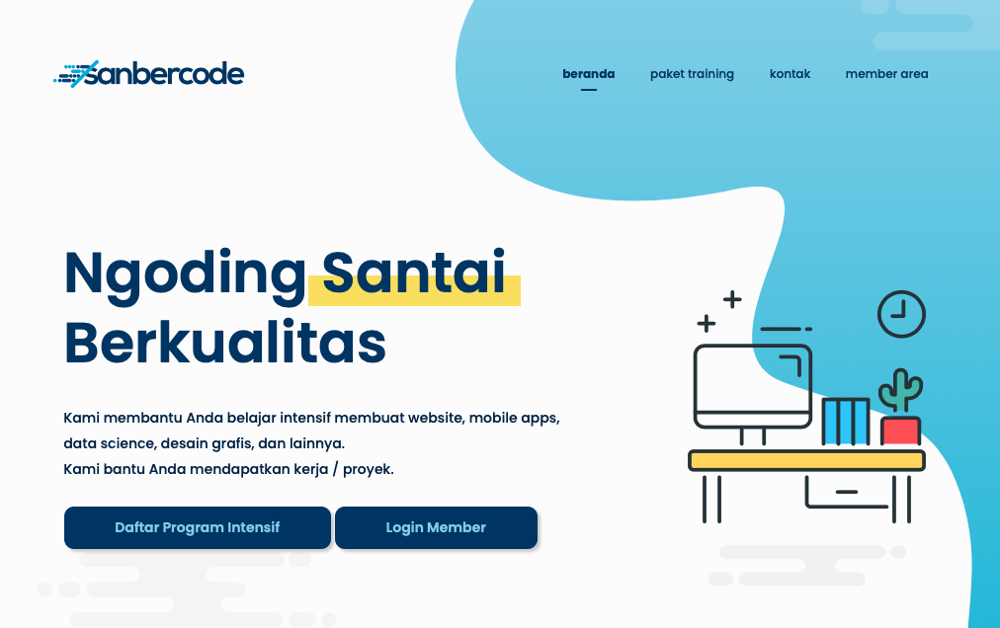

# IMRN0720
## Indonesia Mengoding React Native 2020
Mengikuti pelatihan koding di <a href="http://sanbercode.com">Sanbercode.com</a> selama 4 minggu intensif. Saya mengikuti kelas pemrograman React Native untuk membangun aplikasi mobile Android dan iOS. Setiap hari peserta mengerjakan tugas harian dan per minggu mengerjakan kuis di Akhir Pekan. 

## Materi pelatihan
- Command Line & GIT
- Javascript String & Conditional
- Javascript Loop 
- Javascript Function
- Javascript Array
- Javascript Object
- Javascript Class 
- Javascript Asynchronous 
- Javascript ES6
- React Native Introduction
- Mockup with Figma (UI Design)
- React Native Component
- Styling and Flexbox
- Component API and Lifecycle 
- React Native Core Component 
- React Navigation
- Redux State Management
- API Library
- Final Project 

